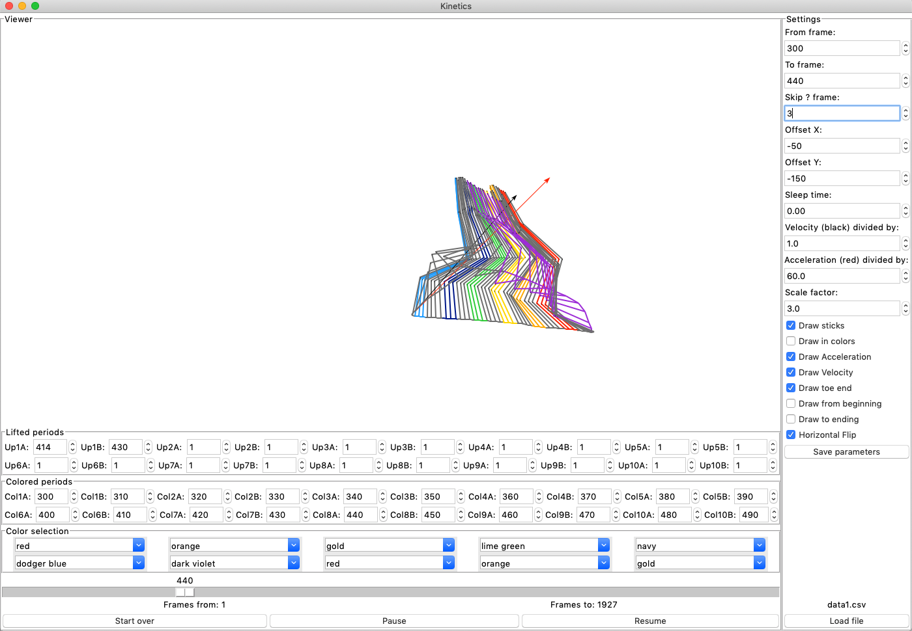

# Limb Movement Kinetics
Mouse Lower limb movement's kinetics.

## Introduction

This project is made on a demand from my friend. The demand is to draw the kinetics graph of a mouse's limb's movement.  
Beyond the demand, I also added a feature that can show the movement in animation. A set of **GUI-based** controllers are also added, to adjust the parameters.  
Parameters used for different files can also be saved **respectively** for reuse.  
I used **pandas** to process the data and **tkinter** for the visualization part, both based on Python 3.7.   

## Scrennshot

**Main Interface**



## Requirements

pandas
pickle

## How to use
```
python3 __main__.py
``` 
